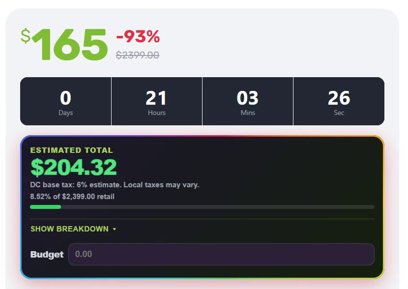

# MAC.BID True Price

What a [MAC.BID](https://www.mac.bid) lot actually costs — buyer's premium, lot fee and sales tax — before you bid.



Two tools sharing one fee model:

- **Chrome extension** (`extension/`) — injects the all-in total straight into mac.bid lot pages and keeps it current as bids change.
- **Web calculator** (`index.html`) — a standalone page with lot search, a retail comparison and a reverse calculator that turns a budget into a max safe bid.

Not affiliated with MAC.BID.

## The math

```
total = (bid + bid × 15% + $3 lot fee + optional assurance) × (1 + tax rate)
```

Fee structure per [mac.bid's terms of use](https://www.mac.bid/terms-of-use). Tax uses each state's **base** rate — the local rate at your pickup warehouse may be slightly higher, so set a custom rate when you need an exact figure.

## Chrome extension

Adds an estimated-total panel to lot pages, showing the all-in price, what percentage of retail you're paying, a collapsible fee breakdown, and a budget field that works backwards to a max safe bid. Budgets are saved per lot and expire when the auction ends. Listing and search pages get compact `Est. $…` badges.

Premium rate, lot fee, a custom tax rate and the RGB panel glow are configurable on the options page. Buyer's Assurance is not — it follows the checkbox on the lot page itself.

### Install from source

1. Open `chrome://extensions` and enable **Developer mode**.
2. Click **Load unpacked** and select the `extension/` folder.
3. Visit a MAC.BID lot page — the estimated total panel appears under the countdown.

After editing any extension file, click **Reload** on the extension card, then refresh the page. Content scripts do not hot-reload.

> Only load one copy at a time. Two installs both inject into the page, fight over the same panel element, and produce a visible flicker.

### Development

```bash
npm test
```

Runs the shared fee, tax and parser suites on Node's built-in test runner. No dependencies, no build step.

### Packaging for the Chrome Web Store

```bash
npm run package
```

Writes `macbid-true-price-<version>.zip` at the repo root, containing only the runtime files — the `tests/` folder is excluded, and archive paths use forward slashes so the `shared/` folder survives unpacking. Bump `version` in `extension/manifest.json` first; the store rejects an upload that isn't newer than the published one.

The listing also needs a privacy policy URL, which is what `privacy.html` is for — host it (GitHub Pages works) and paste the URL into the dashboard.

### Manual verification checklist

- The unpacked extension loads without manifest errors.
- A lot page shows an estimated total panel.
- The total matches `(bid + bid × 0.15 + 3 + assurance) × (1 + taxRate)`.
- Updating the budget field updates the max safe bid.
- Changing options updates the lot page after a refresh or storage change.
- Editing the current bid text in DevTools updates the panel within ~150ms.
- Listing and search pages show compact `Est. $…` badges where bid text is visible.

### Debugging

The content script carries flag-gated logging, off unless you turn it on from the page console:

```js
localStorage.setItem('macbidDebug', '1')
```

Refresh, and every panel rebuild logs which fields changed, which DOM mutation triggered the render, and a per-instance id that makes duplicate injections obvious. Turn it off with `localStorage.removeItem('macbidDebug')`.

## Web calculator

`index.html` is the entire app — HTML, CSS and JS in one file, no build.

### Deploy to GitHub Pages

**Settings → Pages → Source: Deploy from a branch → Branch: `main` / root → Save**

The site goes live at `https://<your-username>.github.io/macbid-calc/` after a minute. The app must be served from the repo **root** — `index.html`, `manifest.json` and `privacy.html` stay there for that reason.

On a phone, open the URL and use **Add to Home Screen** to install it like a native app.

### If search shows a CORS error

The app calls mac.bid's public search API straight from the browser. If mac.bid blocks cross-origin requests you'll see a CORS message under the search box. Free fix, about two minutes:

1. Sign in at [dash.cloudflare.com](https://dash.cloudflare.com) → **Workers & Pages → Create → Worker**.
2. Replace the default code with the contents of `worker.js` and **Deploy**.
3. Copy the worker URL (looks like `https://macbid-proxy.<you>.workers.dev`).
4. In `index.html`, find the `API_BASE` constant near the top of the `<script>` block and point it at the worker:
   ```js
   const API_BASE = 'https://macbid-proxy.<you>.workers.dev/search';
   ```
5. Commit and push.

## Repository layout

| Path | What it is |
|---|---|
| `extension/` | Chrome extension (Manifest V3) source — load this folder unpacked |
| `extension/shared/` | Fee, tax and parsing logic shared by the content script, options page and tests |
| `extension/tests/` | Node test-runner suites |
| `scripts/package.mjs` | Builds the Chrome Web Store zip |
| `index.html` | The standalone web calculator |
| `manifest.json` | **PWA** manifest for the web app — not the extension's, which lives in `extension/` |
| `privacy.html` | Privacy policy, required for the Web Store listing |
| `worker.js` | Optional Cloudflare Worker CORS proxy |
| `docs/` | Design spec and implementation plan |
| `assets/` | Screenshot, app icons (`icon-192`/`icon-512` for the PWA, `icon-180` for iOS) and source artwork |

## Notes

- Search loads the **current** bid — adjust it to what you actually plan to bid.
- Your tax state, assurance setting and budget are remembered in your browser.
- If mac.bid changes their fees, update `LOT` and `PREM` at the top of the script in `index.html`, and `DEFAULT_SETTINGS` in `extension/shared/fees.js`.
